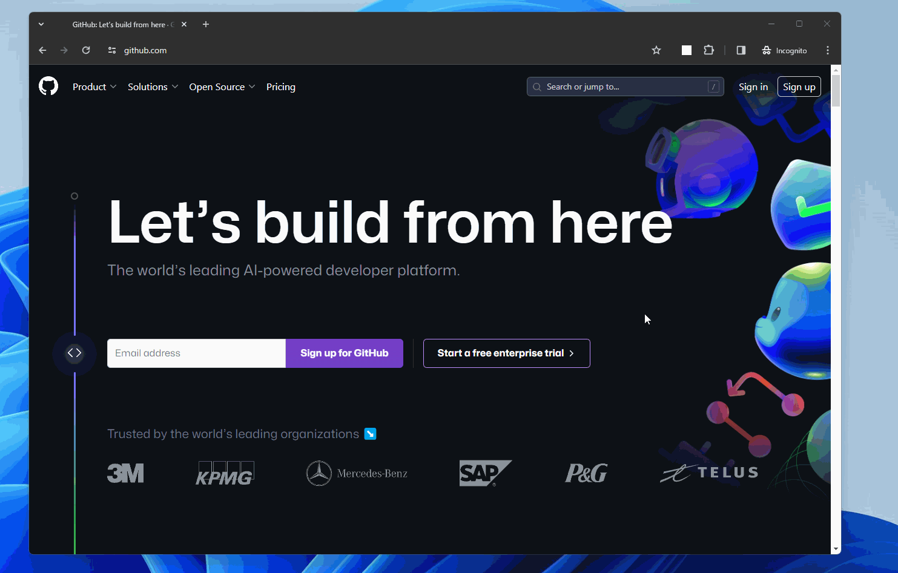

# User gesture Manifest V3 Bug

Even when `chrome.runtime.sendMessage` is triggered as a result of a user gesture, `chrome.runtime.onMessage.addListener` loses the context of being within a user gesture.

https://issues.chromium.org/issues/326889650

## How to reproduce

1. Build

```
git clone https://github.com/mtsmfm/user-gesture-manifest-v3-bug
cd user-gesture-manifest-v3-bug
npm install
npm run build
```

2. Open chrome://extensions and load dist dir as unpacked extension
3. Trigger action by clicking icon

## Screencast


